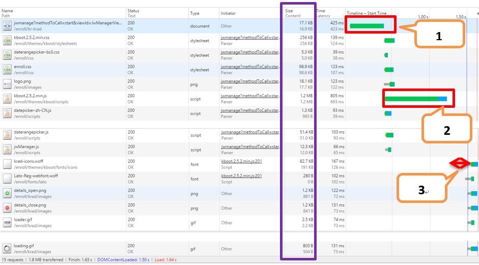
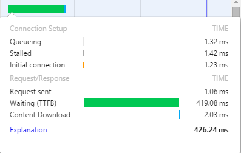
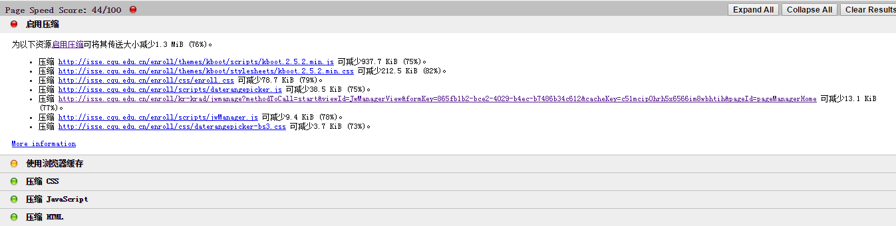
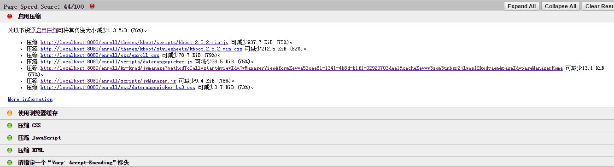
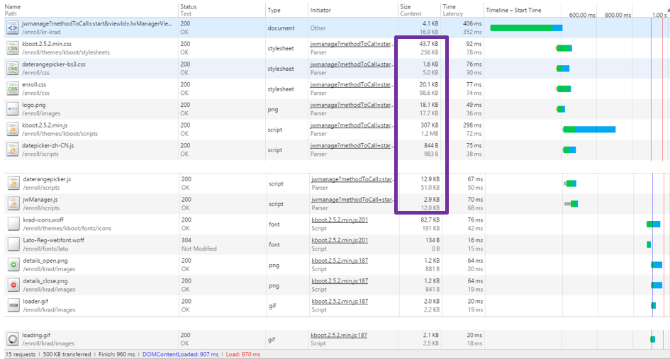
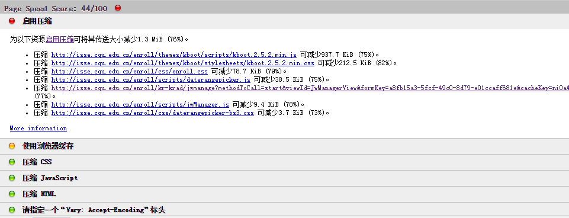

title: 选课系统前端性能评估和解决方案
date: 2016-01-25 13:58:31
categories:
- 前端学习
tags:
- compress
- pageSpeed
- chrome
---

## 性能评估
### 评估内容
网页：选课系统管理员首页
地址：`http://****.cqu.edu.cn/****` 登录名：`******`
内容：样式文件[3/359.6KB]，脚本文件[4/1292.8KB]，图片文件[4/6.4KB]，文字文件[2/191KB]
### 评估工具
> - Chrome dev tools
> - pageSpeed

<!-- more -->

### 评估结果与分析
1.使用chrome开发者工具查看如下图1所示：
图1

其中，
> Size = Transfer size 【Compression(Content) + Response Header】
> Content = Actual size

第一条请求中的消耗时间分布图如图2：
图2

其中，TTFB (Time To First Byte)，是最初的网络请求被发起到从服务器接收到第一个字节这段时间，它包含了 TCP连接时间，发送HTTP请求时间和获得响应消息第一个字节的时间。

2.使用pageSpeed插件分析如下图3所示：
图3

3.结果分析
- 图1中1标签为主页面请求，该请求时间消耗如图2所示，由图可知该部分主要时间消耗在后台处理和请求传输上，因此需进行后台和网络优化。
- 由图1中的content和size的大小对比以及图2中的结果可知前端静态文件未启用压缩是影响该系统前端性能的关键因素，因此造成图1中如标记2所示的由于文件较大而造成的时间消耗。
- 图1中3标签时间消耗主要来自于前端js阻塞。页面在遇到js标签则会等待js脚本的解析和执行。因此当脚本解析执行完成后才会进行页面元素的下载和页面渲染。

## 提高性能方案
首先开启服务端压缩，减小传输内容大小，从而提高内容下载速度。
进一步解决js阻塞问题，目前已知的方法有合并脚本、延迟脚本加载等（待下一步具体研究）。

## 启用压缩
### 本地Tomcat启用压缩
#### 配置Tomcat压缩

配置%tomcatHome%conf/server.xml
```xml
<Connector port="8080" protocol="HTTP/1.1"
        connectionTimeout="20000"
        redirectPort="8443" 
	compression="on" 
        compressionMinSize="100" 
        noCompressionUserAgents="" 
        compressableMimeType="text/html,text/xml,text/css,application/javascript"/>

```

其中关键代码为：
> compression="on" //启用压缩
> compressionMinSize="2048" //启用压缩的输出内容大小，这里面默认为2KB
> noCompressionUserAgents="" //对于其中的浏览器，不启用压缩 
> compressableMimeType="text/html,text/xml,text/css,application/javascript"//压缩类型
*注：js文件类型在tomcat7中改为application/javascript，文件类型表示在tomcat下的web.xml文件中可以查看。*

#### 测试压缩结果
测试代码：
```java
import org.apache.commons.httpclient.HttpClient;
import org.apache.commons.httpclient.methods.GetMethod;

public class test  {
	public static void main(String[] args) throws Exception{
		  HttpClient http = new HttpClient();
	GetMethod get = new GetMethod("http://isse.cqu.edu.cn/enroll/themes/kboot/stylesheets/kboot.2.5.2.min.css");//添加文件地址
		  try{
		  	get.addRequestHeader("accept-encoding", "gzip,deflate");
get.addRequestHeader("user-agent", "Mozilla/5.0 (Windows NT 6.2) AppleWebKit/537.36 (KHTML, like Gecko) Chrome/47.0.2526.80 Safari/537.36");
		  	System.out.println(get.getRequestHeaders());
		  	int er = http.executeMethod(get);
		  	if(er==200){
		   		String html = get.getResponseBodyAsString();
		   		System.out.println(html);
		   		System.out.println(html.getBytes().length);
		   		System.out.println(get.getResponseContentLength());
		  	}
		}finally{
		   get.releaseConnection();
		}
	  }
}

```

其中`System.out.println(html)`打印结果为乱码，且
`System.out.println(get.getResponseContentLength())`打印结果为-1则表明文件已经被压缩。
测试显示前端静态文件均已被压缩。

#### 本地压缩前后对比
1.chrome查看content与size大小对比

统计图中数据汇总如下表格所示：

|文件名             |Content(KB)|Size(KB)  |压缩率    |
|:-----------------:|:---------:|:--------:|:--------:|
|Kboot.2.5.2.min.css|	256|	44.6|	0.825781|
|daterangepicker-bs3.css|	5.0|	1.6|	0.68|
|enroll.css|	98.6|	20.5|	0.792089|
|kboot.2.5.2.min.js|	1228.8|	312|	0.746094|
|datepicker-zh-CN.js|	0.96|	0.8|	0.166667|
|daterangepicker.js|	51.0|	13.1|	0.743137|
|jwManager.js|	12|	2.9|	0.758333|
|合计|	1652.36|	395.5|	0.760645|

> Content = Actual size
> Size = Transfer size 【Compression(Content) + Response Header】
> 压缩率=(content-size)/content
结论：通过Tomcat启动压缩后对前端的静态文件（css和javascript文件）的平均压缩率为76%。

2.压缩前后pagespeed评估结果对比
启用压缩前：


启用压缩后：


### 服务器配置压缩
#### Apache配置压缩
在%apacheHome%conf/hppd.conf文件中开启以下两个模块，即将其前面的#去除。
```xml
LoadModule deflate_module modules/mod_deflate.so
LoadModule headers_module modules/mod_headers.so
LoadModule filter_module modules/mod_filter.so
```

在文件最后添加如下代码：
```xml
<IfModule mod_deflate.c>
       DeflateCompressionLevel 7
       AddOutputFilterByType DEFLATE text/html application/javascript text/css text/xml text/javascript 
       AddOutputFilter DEFLATE css js
       SetOutputFilter DEFLATE     
       SetEnvIfNoCase Request_URI \.(?:gif|jpe?g|png)$ no-gzipdont-vary
       SetEnvIfNoCase Request_URI .(?:exe|t?gz|zip|bz2|sit|rar)$ no-gzipdont-vary
       SetEnvIfNoCase Request_URI .(?:pdf|mov|avi|mp3|mp4|rm)$ no-gzipdont-vary
</IfModule>
```

*注：Apache2.2版本后若不启用filter_module模块，使用httpd –t命令测试配置的正确性会出现如下错误：*
> D:\tools\Apache24\bin>httpd -t
AH00526: Syntax error on line 613 of D:/tools/Apache24/conf/httpd.conf:
Invalid command 'AddOutputFilterByType', perhaps misspelled or defined by a module not included in the server configuration

#### 服务器端压缩前后对比
1.chrome查看content与size大小对比
启动压缩后：


统计图中数据汇总如下表格所示：

|文件名             |Content(KB)|Size(KB)  |压缩率    |
|:-----------------:|:---------:|:--------:|:--------:|
|Kboot.2.5.2.min.css|	256|	43.7|	0.829297|
|daterangepicker-bs3.css|	5.0|	1.6|	0.68|
|enroll.css|	98.6|	20.1|	0.796146|
|kboot.2.5.2.min.js|	1228.8|	307|	0.750163|
|datepicker-zh-CN.js|	0.96|	0.82|	0.145833|
|daterangepicker.js|	51.0|	13.1|	0.743137|
|jwManager.js|	12|	2.9|	0.758333|
|合计|	1652.36|	389.22|	0.764446|

结论：在服务器端启动apache压缩后，前端的静态文件（css和javascript文件）的平均压缩率可达76.4%。
2.压缩前后pagespeed评估结果对比
启用压缩前：


启用压缩后：


结论：Apache服务端启动压缩后pagespeed评估得分由44增长至92（满分100分）。

#### 服务器端启动压缩其他方式
1.Tomcat启动压缩
与本地同样方式配置服务器端Tomcat压缩，使用评估测试工具检测浏览器获取的前端静态文件并未完成压缩。
原因：服务器是Apache+Tomcat集成的，压缩配置不起作用，是因为用户是通过浏览器访问Apache服务器，Apache服务器在转发请求到Tomcat去处理,它俩之间数据传输是通过另外一个连接器(Connector)[<Connector port="8009" protocol="AJP/1.3" redirectPort="8443" URIEncoding="UTF-8"/>]，但是AJP协议目前貌似还不支持GZIP的配置。

2.使用pjl-comp-filter配置压缩
在项目中导入pjl-comp-filter-1.7.jar，再在web.xml文件中添加
```xml
<filter>
    <filter-name>CompressingFilter</filter-name>
    <filter-class>com.planetj.servlet.filter.compression.CompressingFilter</filter-class>
    <init-param>
        <param-name>compressionThreshold</param-name>资源大小超过100B的就被压缩
        <param-value>100</param-value>
    </init-param>
        <init-param>
        <param-name>includeContentTypes</param-name>启动GZIP压缩的MIME类型
        <param-value>text/html,text/xml,text/javascript,text/css,text/plain</param-value>
    </init-param>
</filter>
<filter-mapping>
    <filter-name>CompressingFilter</filter-name>
    <url-pattern>/*</url-pattern>
</filter-mapping>
```

结果：在本地测试成功，但在服务器上运行结果仍是未被压缩。